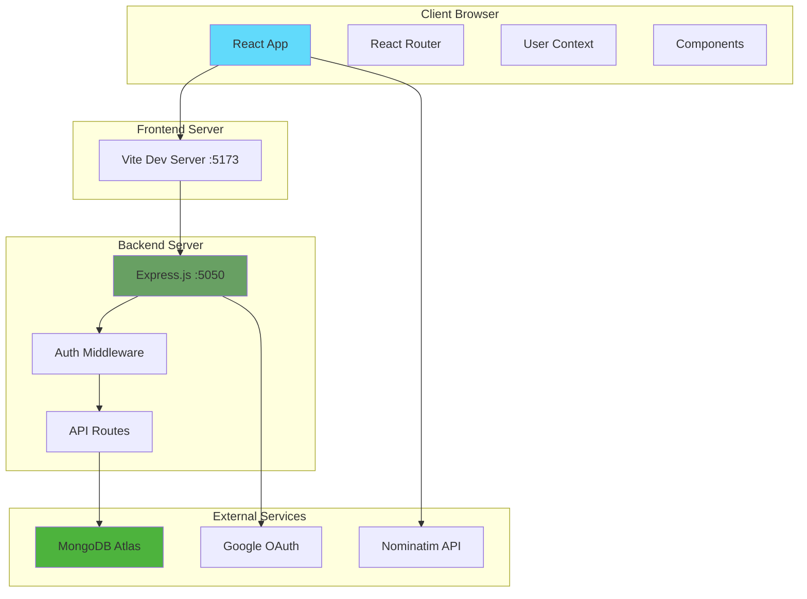
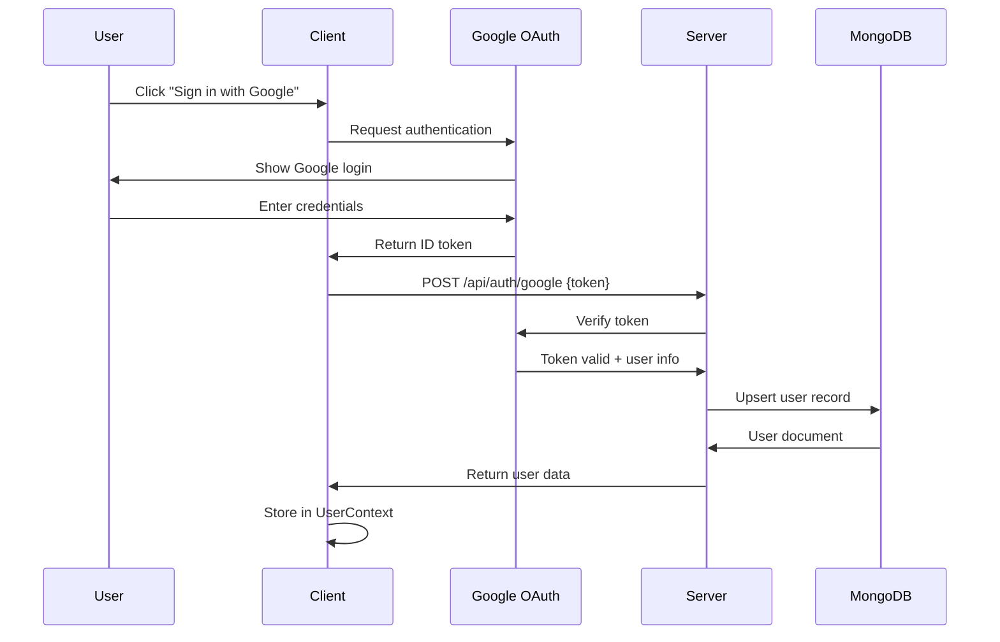
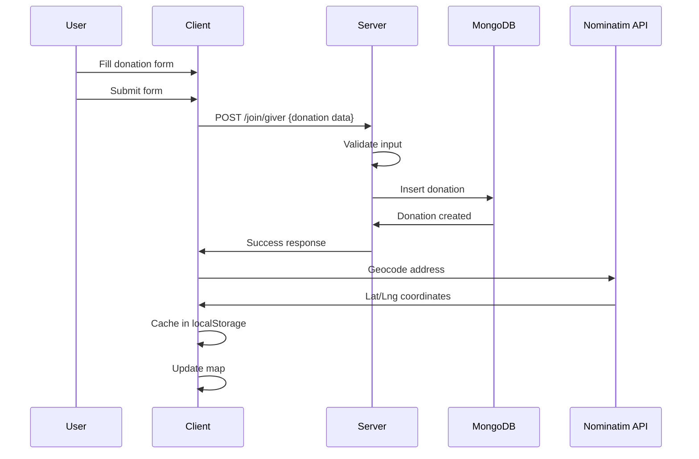
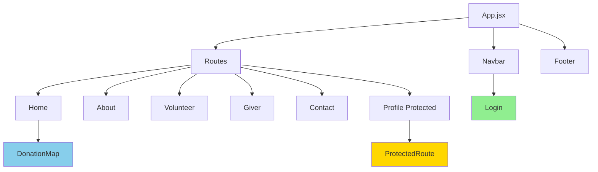

# System Architecture - Kilometros de Vida

## Overview
Kilometros de Vida is a full-stack MERN application connecting food donors with volunteer drivers to reduce food waste and alleviate hunger.

## Technology Stack

### Frontend
- **React 19** with Vite for fast development
- **React Router** for client-side routing
- **Tailwind CSS 4** for styling
- **Framer Motion** for animations
- **Axios** for HTTP requests
- **React Leaflet** for map visualization

### Backend
- **Node.js** with Express.js
- **MongoDB Atlas** for database
- **Google OAuth 2.0** for authentication
- **Nominatim API** (OpenStreetMap) for geocoding

## System Architecture Diagram



## Data Flow

### Authentication Flow


### Donation Creation Flow


## Component Hierarchy



## API Endpoints

### Authentication
| Method | Endpoint | Description | Auth Required |
|--------|----------|-------------|---------------|
| POST | `/api/auth/google` | Verify Google token and create/update user | No |

### Donations (Givers)
| Method | Endpoint | Description | Auth Required |
|--------|----------|-------------|---------------|
| POST | `/join/giver` | Create new donation | No* |
| GET | `/api/data` | Get all donations (public) | No |
| GET | `/api/my-donations` | Get user's donations | Yes |
| PUT | `/api/donations/:id` | Update donation | Yes |
| DELETE | `/api/donations/:id` | Delete donation | Yes |

*Links to user if logged in

### Volunteers (Drivers)
| Method | Endpoint | Description | Auth Required |
|--------|----------|-------------|---------------|
| POST | `/join/driver` | Register as volunteer | No* |
| GET | `/api/my-volunteer-shifts` | Get user's shifts | Yes |

## Database Schema

### Collections

#### users
```javascript
{
  _id: ObjectId,
  email: String (unique),
  name: String,
  picture: String (URL),
  lastLogin: Date
}
```

#### givers (donations)
```javascript
{
  _id: ObjectId,
  userId: String (optional, links to user),
  orgName: String,
  contactPerson: String,
  donorEmail: String,
  donorPhone: String,
  foodType: String,
  pickupTime: String,
  address: String,
  createdAt: Date
}
```

#### drivers (volunteers)
```javascript
{
  _id: ObjectId,
  userId: String (optional),
  volunteerName: String,
  volunteerEmail: String,
  volunteerPhone: String,
  availability: String,
  createdAt: Date
}
```

## Security Measures

### Implemented
1. **Google OAuth 2.0**: Secure authentication without password storage
2. **Environment Variables**: Sensitive data in `.env` files
3. **Protected Routes**: `ProtectedRoute` component prevents unauthorized access
4. **Input Validation**: Server-side validation for all form submissions
5. **CORS**: Configured to allow frontend-backend communication