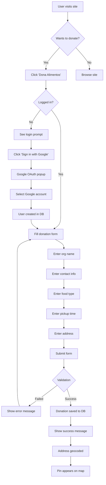
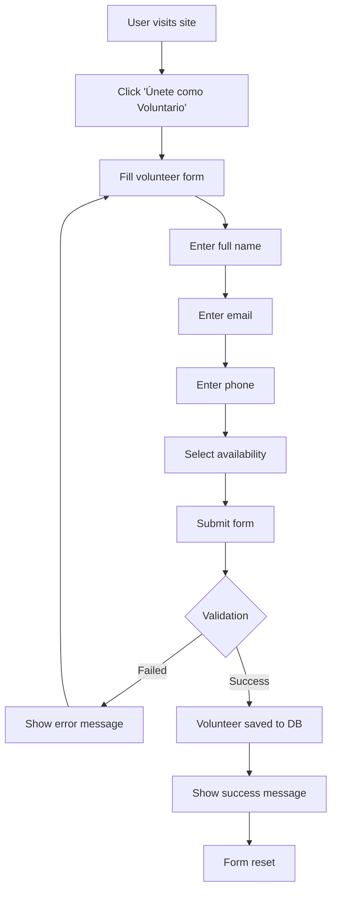
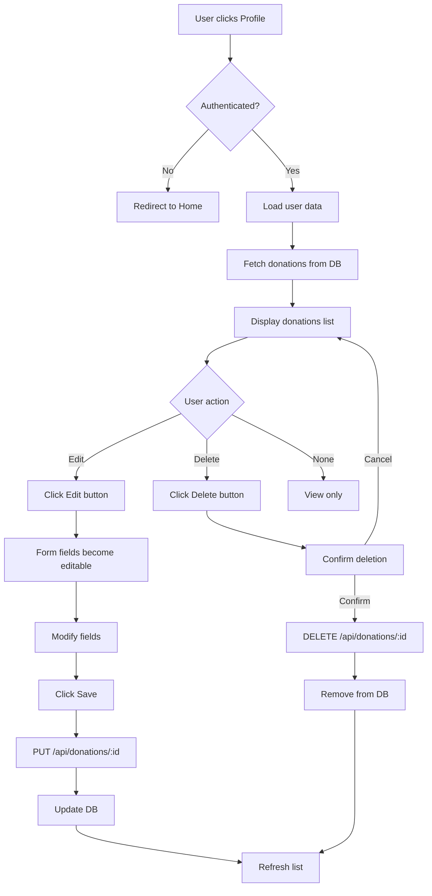
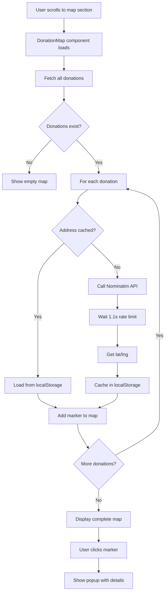
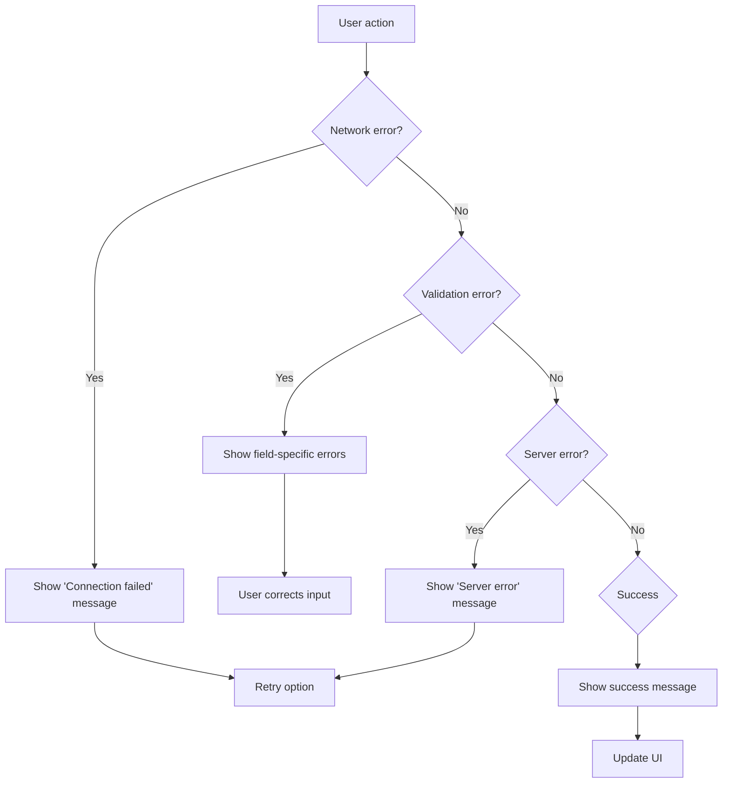

# User Workflows - Kilometros de Vida

## Overview
This document outlines the key user workflows in the Kilometros de Vida application.

## 1. New User Registration & First Donation

## 2. Volunteer Registration Workflow

## 3. Managing Donations (Profile Page)

## 4. Viewing Impact Map

## 5. Error Handling Workflow

## User Journey Map

### Donor Journey
1. **Discovery**: User learns about food waste problem
2. **Awareness**: Sees impact statistics on homepage
3. **Interest**: Clicks "Dona Alimentos"
4. **Action**: Fills out donation form
5. **Confirmation**: Sees success message
6. **Engagement**: Sees their location on map
7. **Retention**: Returns to profile to manage donations

### Volunteer Journey
1. **Motivation**: Wants to help community
2. **Exploration**: Reads "Cómo Funciona" section
3. **Decision**: Clicks "Únete como Voluntario"
4. **Registration**: Fills availability form
5. **Confirmation**: Receives success message
6. **Future**: (Could add) Receives notifications for nearby pickups